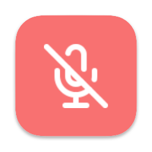

<p align="center">
  
</p>

<h1 align="center">Mic Mute for macOS</h1>

A system-wide mute for macOS microphones with a global shortcut and visual confirmation of mute status. Inspired by [VCM](https://learn.microsoft.com/en-us/windows/powertoys/video-conference-mute) for Windows.


Mute with <kbd>Cmd</kbd> <kbd>Shift</kbd> <kbd>A</kbd> or from the system tray dropdown.

## Features

- CoreAudio API mute input devices
  - [x] Mute input devices
    - Note: Some virtual devices may be unable to mute for now
  - [x] Provide global hotkey muting
  - [x] Poll new devices to mute while microphones should be off
- Visual confirmation of mute status
  - [x] Show microphone mute status in system tray
  - [x] Show microphone mute status in small popup window
  - [x] Popup window shouldn't appear in screenshots or recordings and ignores mouse events
  - [x] Popup follows screens and monitors with cursor
- [ ] Support camera toggle
- [ ] Add configurable settings (hotkey, window position)
- [ ] Open app on system startup

## Releases

I have not elected to sign the app by joining the Apple Developer Program. The releases have been self-signed by me and can be installed by bypassing the typical app security on macOS. You're also welcome to build and bundle the app yourself with the simple instructions described below.

[View releases](https://github.com/brettinternet/mic-mute/releases)

## Build

[Install Rust](https://www.rust-lang.org/tools/install). Then, [install go-task](https://taskfile.dev/installation/) or run the commands from the Taskfile separately yourself.

Install the build dependencies, build and bundle the app.

```
task build
```

Once the build is complete, a finder window should open to the built bundle in the the folder `./target/aarch64-apple-darwin/release/bundle/osx`.

## Develop

### Setup

[Install Rust](https://www.rust-lang.org/tools/install). Then, [install go-task](https://taskfile.dev/installation/) or run the commands from the Taskfile separately yourself.

Install development dependencies.

```sh
task init
```

### Run

Run and watch for changes.

```sh
task start
```

## License

Licensed under MIT license ([LICENSE](LICENSE) or http://opensource.org/licenses/MIT).

## Contribution

Unless you explicitly state otherwise, any contribution intentionally submitted
for inclusion in the work by you, shall be licensed as above, without any additional terms or conditions.
