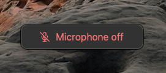

# Mic Mute for macOS

A system-wide mute for macOS microphones with a global shortcut and visual confirmation of mute status. Inspired by [VCM](https://github.com/microsoft/PowerToys/issues/21473) for Windows.



Mute with <kbd>Cmd</kbd> <kbd>Shift</kbd> <kbd>A</kbd> or from the system tray dropdown.

## Features

- CoreAudio API mute input devices
  - [x] Mute input devices
    - Note: Some virtual devices may be unable to mute for now
  - [x] Provide global hotkey muting
  - [ ] Mute newly connected input devices
  - [ ] While active, keep input devices muted even if toggled by other methods
- Visual confirmation of mute status
  - [x] Show microphone mute status in system tray
  - [x] Show microphone mute status in small popup window
  - [x] Popup window shouldn't appear in screenshots or recordings and ignores mouse events
  - [x] Popup follows screens and monitors with cursor
- [ ] Support camera toggle
- [ ] Add configurable settings (hotkey, window position)
- [ ] Open app on system startup

## Develop

### Setup

[Install Rust](https://www.rust-lang.org/tools/install).

Optionally, [install go-task](https://taskfile.dev/installation/).

Install development dependencies.

```sh
task init
```

### Run

Run and watch for changes.

```sh
task start
```

## License

Licensed under either of

- Apache License, Version 2.0
  ([LICENSE-APACHE](LICENSE-APACHE) or http://www.apache.org/licenses/LICENSE-2.0)
- MIT license
  ([LICENSE-MIT](LICENSE-MIT) or http://opensource.org/licenses/MIT)

at your option.

## Contribution

Unless you explicitly state otherwise, any contribution intentionally submitted
for inclusion in the work by you, as defined in the Apache-2.0 license, shall be
dual licensed as above, without any additional terms or conditions.
